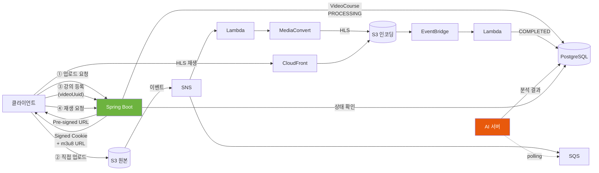

# Insty Backend

> 개발자·학습자가 새 기술을 배울 때 처음 부딪히는 문제를 짧은 강의 영상으로 해결하는 **영상 기반 개발 학습 플랫폼**의 백엔드입니다.

| 항목 | 내용 |
|---|---|
| 기간 | 2025.05 – 2025.07 |
| 인원 | 백엔드 2 · 프론트 2 · AI 1 · 기획 1 |
| 담당 | 백엔드 — 인증·회원 도메인, 강의·영상 업로드 도메인, Spring Security 인프라 |
| 기술 | Java 17 · Spring Boot 3.4 · Spring Security · JWT · OAuth2 · JPA · QueryDSL · PostgreSQL · Redis · AWS S3/CloudFront |

<br>

## 목차

1. [서비스 개요](#1-서비스-개요)
2. [시스템 아키텍처](#2-시스템-아키텍처)
3. [영상 처리 파이프라인](#3-영상-처리-파이프라인)
4. [프로젝트 구조](#4-프로젝트-구조)
5. [도메인 모델](#5-도메인-모델)
6. [API 개요](#6-api-개요)
7. [담당 파트](#7-담당-파트)

<br>

## 1. 서비스 개요

- **크리에이터**가 강의 영상을 업로드하고 강의(제목·설명·핵심 포인트·설치 환경 체크리스트·실습 자료·태그)를 게시합니다.
- **러너**는 강의를 검색·수강하고, 1분 미리보기 후 본편을 HLS 스트리밍으로 시청합니다.
- 강의별 **커뮤니티**에서 질문을 올리고, 텍스트·이미지·영상으로 답변을 받고, 답변을 채택할 수 있습니다.
- 러너는 크리에이터에게 원하는 **강의를 요청**할 수 있습니다.
- 업로드된 영상은 별도 **AI 서버**가 분석해 벡터 DB에 저장합니다.

<br>

## 2. 시스템 아키텍처


| 구성 | 설명 |
|---|---|
| 네트워크 | VPC · Public subnet(Bastion/NAT) · Private subnet(EC2, RDS) · ALB · CloudFront · Route53 · ACM |
| 애플리케이션 | EC2 ① Nginx + Next.js + **Spring Boot** + Redis / EC2 ② Nginx + AI 서버 + Redis (모두 Docker) |
| 데이터 | Amazon RDS (PostgreSQL) · Redis (Refresh Token) |
| 영상 | S3(원본) · S3(인코딩) · SNS · SQS · Lambda · MediaConvert · EventBridge · CloudFront |
| 배포 | GitHub Actions → GHCR → self-hosted runner · Blue/Green · Slack 알림 |

<br>

## 3. 영상 처리 파이프라인

백엔드가 영상 바이트를 직접 다루지 않고, 인코딩을 기다리지도 않는 **완전 비동기 이벤트 기반** 구조입니다.



- **SNS**는 S3 이벤트를 "인코딩(Lambda)"과 "AI 분석(SQS)" 두 소비자에게 동시에 뿌리는 pub/sub 역할입니다.
- **SQS**는 AI 서버가 바쁘거나 재배포 중이어도 메시지가 유실되지 않도록 버퍼링합니다. AI 서버가 polling으로 가져갑니다.
- 인코딩 완료는 Lambda가 DB(`video_encodings`, `encoding_status`)에 직접 기록하며, 백엔드에는 콜백 API가 없습니다.
- 재생 시점에 상태를 검사해 `PROCESSING`이면 "인코딩 중", `FAILED_*`면 실패 사유별 에러코드를 반환합니다.

<br>

## 4. 프로젝트 구조

Gradle 멀티모듈로 관심사를 분리했습니다.

```
insty-backend-web
├── insty-api        실행 모듈 — Controller · Service · implement(Reader/Writer/Validator) · Security · 예외 처리
├── insty-domain     JPA Entity · Repository · QueryDSL · 검색 DTO · testFixtures
├── insty-common     JwtUtils · FileUtils · 상수 · ErrorCode enum · CustomException · NicknameGenerator
└── insty-external   외부 시스템 어댑터 — S3 · CloudFront · Redis · 소셜(Kakao/Naver/Google) · AI 서버
```

```
api ──▶ domain ──▶ common
 └────▶ external ─▶ common
```

**레이어 규칙**

```
Controller → Service → implement (Reader / Writer / Validator / Manager) → Repository
```

- `Service`는 유스케이스 조립만 담당하고, 실제 단위 로직은 `implement` 패키지의 `XxxReader`(조회) · `XxxWriter`(변경) · `XxxValidator`(검증)가 맡습니다.
- Entity는 `@Builder(access = PROTECTED)` + `static create()` 팩토리 + `validateCreate()`로 생성 시점에 불변식을 검증합니다.
- 응답은 `SuccessRes<T> { success, data }` / `FailRes { success, error: { code, message } }`로 통일하고, 도메인별 `ErrorCode` enum을 `ExceptionAdvice`가 HTTP 상태코드로 변환합니다.

<br>

## 5. 도메인 모델

| 도메인 | 엔티티 | 설명 |
|---|---|---|
| user | `User` | 이메일/소셜 회원 공용. `socialId + socialType`으로 소셜 식별, `userType`(LEARNER / CREATOR / NONE) |
| course | `Course` `CourseKeypoint` `CourseInstallEnvChecklist` `CoursePracticeFile` `CourseTag` `CourseRequest` | 강의 본문 + 핵심 포인트 + 설치 환경 체크리스트 + 실습 자료 + 태그, 러너→크리에이터 강의 요청 |
| video | `VideoCourse` `VideoAnswer` `VideoEncoding` | 원본 영상 메타(`s3Key = vod/{type}/{ext}/{uuid}/{name}`), 인코딩 결과(Lambda 기록) |
| file | `File` | 범용 파일 테이블. `containerType + containerId`로 소유자 식별 |
| community | `CommunityQuestion` `CommunityAnswer` `CommunityFile` `CommunityAnswerFile` | 강의별 Q&A, 답변 채택, 첨부파일·이미지·영상 답변 |
| tag | `Tags` | 유니크 태그 |

<br>

## 6. API 개요

| 영역 | 경로 | 주요 기능 |
|---|---|---|
| **Auth** | `/api/v1/auth` | 이메일 로그인 · 소셜 인가 URL · 소셜 로그인 · 토큰 재발급 · 로그아웃 |
| **User** | `/api/v1/users` | 회원가입 · 이메일/닉네임 중복 체크 · 프로필 조회/수정 · 비밀번호 변경 · 유저 타입 전환 · 이메일 수신 동의 |
| **Course** | `/api/v1/courses` | 강의 CRUD · 목록 검색(페이징) · 내 강의 · 강의 요청 |
| **Video** | `/api/v1/videos` | Pre-signed URL 발급 · 썸네일 · HLS 재생 · 미리보기 |
| Community | `/api/v1/community` | 질문/답변 CRUD · 첨부파일 · 답변 채택 |

인가는 `@EnableMethodSecurity` + `@PreAuthorize("hasRole('CREATOR')")` 형태의 메서드 시큐리티로 제어하고, Swagger(springdoc)에 `@CustomExceptionDescription`으로 에러 케이스를 문서화했습니다.

<br>

## 7. 담당 파트

### 7-1. 인증 인프라

```
insty-api/global/config/SecurityConfig                    시큐리티 필터 체인, CORS, AuthenticationManager
insty-api/global/security/jwt/JwtAuthenticationFilter     Bearer 토큰 검증 → SecurityContext 저장
insty-api/global/security/LoginAuthenticationProvider     이메일/비밀번호 인증 (BCrypt)
insty-api/global/security/resolver/CurrentUserArgumentResolver   @CurrentUser Long userId
insty-common/util/JwtUtils                                토큰 생성·검증·클레임 추출 (auth0 java-jwt, HMAC512)
```

- Access Token(6h, claims: `userType` · `tokenType`)과 Refresh Token(7d, `jti`)을 분리 발급합니다.
- `JwtAuthenticationFilter`가 토큰을 검증해 `JwtAuthenticationToken(userId, ROLE_{userType})`을 SecurityContext에 넣고, 컨트롤러는 `@CurrentUser Long userId`로 꺼내 씁니다.
- 토큰 검증 결과를 `JwtValidationType`(VALID / EXPIRED / INVALID_SIGNATURE / MALFORMED / UNSUPPORTED / CLAIMS_INVALID)으로 세분화하고, 각각을 `TokenErrorCode`로 매핑해 클라이언트가 "만료"와 "위조"를 구분할 수 있게 했습니다.
- 로그인을 시큐리티 필터 방식에서 컨트롤러 + `AuthenticationManager` 직접 호출 방식으로 전환해, 인증 실패도 다른 API와 동일한 `FailRes` 포맷으로 응답합니다.

### 7-2. 토큰 라이프사이클 (Redis)

```
로그인   → Access + Refresh 발급 → Redis  refreshtoken:user:{userId} = refreshToken (TTL 7d)
재발급   → Refresh 서명/만료 검증 → Redis 값 및 jti 일치 확인 → 새 토큰 쌍 발급 → Redis 갱신 (Rotation)
로그아웃 → Redis 키 삭제 → 이후 해당 Refresh Token으로 재발급 불가
```

토큰 발급(`AuthTokenIssuer`) · 검증(`AuthTokenValidator`) · 저장(`AuthTokenRedisWriter`)으로 책임을 나눠 `AuthService`는 흐름만 조립합니다.

### 7-3. 소셜 로그인 — 전략 패턴

```java
public interface SocialStrategy {
    boolean supports(SocialType provider);
    String getAuthUrl(String state);
    User loginBySocial(String code, UserType userType);
}
```

- `KakaoStrategy` · `NaverStrategy` · `GoogleStrategy`가 구현하고, `AuthService`는 `List<SocialStrategy>`에서 `supports()`로 선택합니다. provider가 추가돼도 `AuthService`는 변경되지 않습니다.
- 외부 HTTP 호출(토큰 교환·프로필 조회)은 `insty-external`의 `KakaoService` 등으로 분리해 도메인 로직과 외부 통신을 격리했습니다.
- 인가코드 URL을 서버에서 생성(`GET /auth/login/authorize/{social}`)해 프론트에 client-id가 노출되지 않도록 했습니다.
- 최초 소셜 로그인 시 `NicknameGenerator`로 랜덤 닉네임(형용사 + 동물 + 3자리 숫자)을 부여합니다.

### 7-4. 회원 API

- 회원가입 시 이메일·닉네임 중복 검증, BCrypt 암호화
- 프로필 조회/수정, 프로필 이미지 S3 업로드, 비밀번호 변경, 유저 타입(LEARNER ↔ CREATOR) 전환, 이메일 수신 동의
- **소셜 회원과 이메일 회원 정책 분리**: 소셜 회원은 비밀번호·이메일 변경 불가, 이메일 중복 체크는 소셜 회원 이메일까지 포함

### 7-5. 영상 업로드

```
insty-api/domain/video/service/VideoService           Pre-signed URL 발급, 재생·미리보기 쿠키 발급
insty-api/domain/video/implement/VideoValidator       확장자·contentType 검증, 일일 업로드 제한, 인코딩 상태 검증
insty-api/domain/video/implement/VideoAccessManager   S3 업로드 정보 · CloudFront Signed Cookie 조립
insty-external/s3/adapter/S3UrlIssuer                 S3 Presigner로 PUT URL 생성
insty-external/cloudfront/adapter/CloudFrontSigner    커스텀 정책 Signed Cookie 생성
```

- 서버는 파일명·contentType(mp4 / mov / webm)만 받아 `VideoCourse`(status `PROCESSING`)를 저장하고 **S3 Pre-signed PUT URL**을 발급합니다. 영상 바이트는 서버를 거치지 않고 클라이언트가 S3에 직접 올립니다.
- S3 키는 `vod/{COURSE|ANSWER}/{ext}/{uuid}/{fileName}` 규칙으로 생성해, 이후 인코딩 결과(`vod/{type}/hls/{uuid}/…`)와 미리보기(`preview/…`)를 같은 uuid로 추적합니다.
- 재생 요청 시 `encodingStatus`를 검사해 `COMPLETED`일 때만 **CloudFront Signed Cookie**(Key-Pair-Id · Signature · Policy)를 `HttpOnly; Secure; SameSite=None`으로 내려주고, 마스터 `.m3u8` URL을 반환합니다. 미리보기는 별도 경로·짧은 만료시간으로 동일하게 처리합니다.
- 하루 업로드 가능한 영상 길이 합계를 제한하는 검증(`validateVideoCourseUploadable`)을 두어 인코딩 비용을 통제합니다.

### 7-6. 강의 생성·수정·삭제

```
insty-api/domain/course/service/CourseService            생성·수정·삭제·상세·목록 유스케이스 조립
insty-api/domain/course/implement/CourseVideoManager     업로드된 영상(videoUuid)과 강의 연결, 교체·삭제 시 AI 서버 동기화
insty-api/domain/course/implement/CourseFileWriter       썸네일·실습 자료 S3 업로드
insty-domain/domain/course/persistence/CourseQueryRepositoryImpl   QueryDSL 검색·페이징
```

- **영상 먼저, 강의 나중**: 클라이언트가 먼저 영상을 업로드해 받은 `videoUuid`를 `POST /courses`에 담아 보내면 `CourseVideoManager`가 `VideoCourse`에 강의를 연결합니다. 인코딩 완료를 기다리지 않으므로 강의는 즉시 게시되고, 영상은 인코딩이 끝나는 시점부터 재생됩니다.
- 강의 생성 시 썸네일(확장자 검증) · 실습 자료(최대 2개) · 설치 환경 체크리스트 · 핵심 포인트 · 태그를 한 트랜잭션으로 저장하고, 썸네일이 없으면 영상 기본 썸네일 URL로 대체합니다.
- 강의 수정 시 새 `videoUuid`가 오면 기존 영상을 논리 삭제하고 새 영상을 연결하며, **AI 서버에 `DELETE /api/v1/ai/videos/{uuid}`를 호출**해 벡터 DB를 동기화합니다.
- 목록 조회는 QueryDSL로 검색·페이징한 뒤 태그와 썸네일을 `IN` 조회로 한 번에 가져와 N+1을 피합니다.
- 러너 → 크리에이터 **강의 요청**(`CourseRequest`) 기능을 제공합니다.
