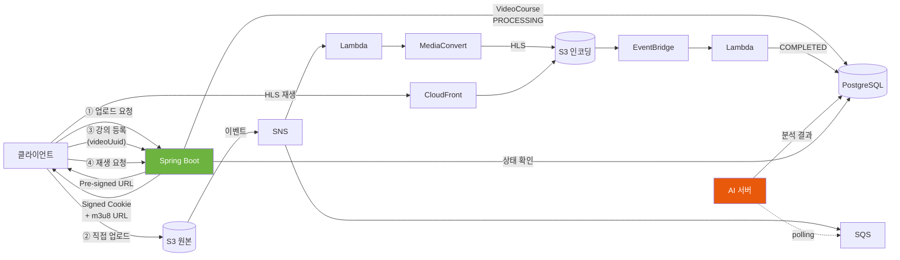
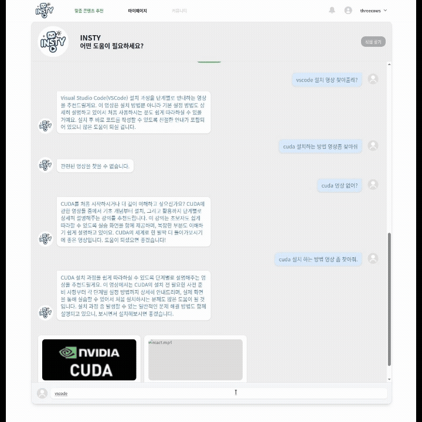
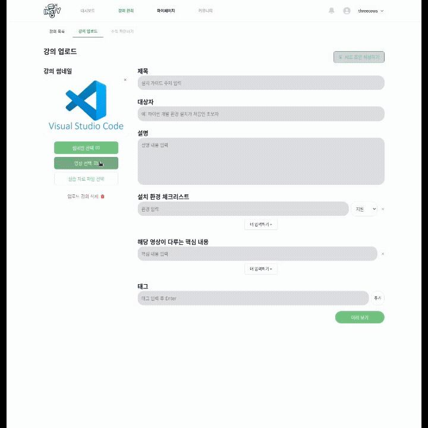

# Insty Backend

> 개발자·학습자가 새 기술을 배울 때 처음 부딪히는 문제를 짧은 강의 영상으로 해결하는 **영상 기반 개발 학습 플랫폼**의 백엔드입니다.

| 항목 | 내용 |
|---|---|
| 기간 | 2025.05 – 2025.07 |
| 인원 | 백엔드 2 · 프론트 2 · AI 1 · 기획 1 |
| 담당 | 백엔드 — 인증·회원 도메인, 강의·영상 업로드 도메인, Spring Security 인프라 |
| 기술 | Java 17 · Spring Boot 3.4 · Spring Security · JWT · OAuth2 · JPA · QueryDSL · PostgreSQL · Redis · AWS S3/CloudFront |

 

## 목차

1. [서비스 개요](#1-서비스-개요)
2. [시스템 아키텍처](#2-시스템-아키텍처)
3. [영상 처리 파이프라인](#3-영상-처리-파이프라인)
4. [화면](#4-화면)
5. [핵심 설계 · 트러블슈팅](#5-핵심-설계--트러블슈팅)

 

## 1. 서비스 개요

- **크리에이터**가 강의 영상을 업로드하고 강의(제목·설명·핵심 포인트·설치 환경 체크리스트·실습 자료·태그)를 게시합니다.
- **러너**는 강의를 검색·수강하고, 1분 미리보기 후 본편을 HLS 스트리밍으로 시청합니다.
- 강의별 **커뮤니티**에서 질문을 올리고, 텍스트·이미지·영상으로 답변을 받고, 답변을 채택할 수 있습니다.
- 러너는 크리에이터에게 원하는 **강의를 요청**할 수 있습니다.
- 업로드된 영상은 별도 **AI 서버**가 분석해 벡터 DB에 저장합니다.

 

## 2. 시스템 아키텍처

| 구성 | 설명 |
|---|---|
| 네트워크 | VPC · Public subnet(Bastion/NAT) · Private subnet(EC2, RDS) · ALB · CloudFront · Route53 · ACM |
| 애플리케이션 | EC2 ① Nginx + Next.js + **Spring Boot** + Redis / EC2 ② Nginx + AI 서버 + Redis (모두 Docker) |
| 데이터 | Amazon RDS (PostgreSQL) · Redis (Refresh Token) |
| 영상 | S3(원본) · S3(인코딩) · SNS · SQS · Lambda · MediaConvert · EventBridge · CloudFront |
| 배포 | GitHub Actions → GHCR → self-hosted runner · Blue/Green · Slack 알림 |

 

## 3. 영상 처리 파이프라인

백엔드가 영상 바이트를 직접 다루지 않고, 인코딩을 기다리지도 않는 **완전 비동기 이벤트 기반** 구조입니다.

```mermaid
flowchart LR
    C[클라이언트]
    API[Spring Boot]
    DB[(PostgreSQL)]
    S3O[(S3 원본)]
    SNS[SNS]
    L1[Lambda]
    MC[MediaConvert]
    S3E[(S3 인코딩)]
    EB[EventBridge]
    L2[Lambda]
    SQS[SQS]
    AI[AI 서버]
    CF[CloudFront]

    C -- "① 업로드 요청" --> API
    API -- "Pre-signed URL" --> C
    API -- "VideoCourse<br/>PROCESSING" --> DB
    C -- "② 직접 업로드" --> S3O
    S3O -- "이벤트" --> SNS
    SNS --> L1 --> MC -- "HLS" --> S3E
    S3E --> EB --> L2 -- "COMPLETED" --> DB
    SNS --> SQS
    AI -. "polling" .-> SQS
    AI -- "분석 결과" --> DB
    C -- "③ 강의 등록<br/>(videoUuid)" --> API
    C -- "④ 재생 요청" --> API
    API -- "상태 확인" --> DB
    API -- "Signed Cookie<br/>+ m3u8 URL" --> C
    C -- "HLS 재생" --> CF --> S3E

    style API fill:#6db33f,color:#fff
    style AI fill:#e8590c,color:#fff
```

- **SNS**는 S3 이벤트를 "인코딩(Lambda)"과 "AI 분석(SQS)" 두 소비자에게 동시에 뿌리는 pub/sub 역할입니다.
- **SQS**는 AI 서버가 바쁘거나 재배포 중이어도 메시지가 유실되지 않도록 버퍼링합니다. AI 서버가 polling으로 가져갑니다.
- 인코딩 완료는 Lambda가 DB(`video_encodings`, `encoding_status`)에 직접 기록하며, 백엔드에는 콜백 API가 없습니다.
- 재생 시점에 상태를 검사해 `PROCESSING`이면 "인코딩 중", `FAILED_*`면 실패 사유별 에러코드를 반환합니다.

 

## 4. 화면

<table>
  <tr>
    <th width="50%">러너</th>
    <th width="50%">크리에이터</th>
  </tr>
  <tr>
    <td></td>
    <td></td>
  </tr>
  <tr>
    <td>AI 챗봇에 "VS Code 설치 영상 찾아줘"처럼 물으면 추천 강의 카드가 뜨고, 미리보기 → 수강 → 시청 중 질문 챗봇으로 이어집니다.</td>
    <td>영상·썸네일을 올리면 전사 진행률을 보여주고, "AI로 초안 작성하기"로 제목·설명·대상·핵심 내용·태그가 자동으로 채워집니다.</td>
  </tr>
</table>

 

## 5. 핵심 설계 · 트러블슈팅

### ① OAuth 2.0 소셜 로그인 전략 패턴 + Refresh Token Rotation

**문제**  카카오·네이버·구글마다 인가 URL, 토큰 교환, 사용자 정보 응답이 전부 달라 로그인 서비스에 분기가 쌓였고, **Provider를 추가할 때마다 기존 코드를 고쳐야** 했습니다.

**해결**  인가 URL 생성, 코드 교환, 사용자 조회를 **하나의 전략 인터페이스**로 묶고 Provider별 구현체를 두었습니다. 토큰은 **재발급마다 새 Refresh Token**을 발급하고 **Redis에 사용자당 하나**만 보관해, 이전 토큰은 즉시 무효가 되고 로그아웃 시 키 삭제로 재발급 경로를 끊습니다.

**결과**  카카오·네이버·구글 로그인 흐름을 인터페이스 하나로 유지했고, 새 Provider는 **구현체 하나를 추가하면 끝**납니다. Refresh Token은 재발급과 동시에 Redis의 이전 값이 덮어써져, 탈취된 토큰으로 재발급을 시도하면 **저장값 불일치로 거부**됩니다. 로그아웃하면 키가 삭제돼 남은 Refresh Token으로는 어떤 토큰도 다시 받을 수 없습니다.

### ② Pre-signed URL 업로드와 이벤트 기반 영상 파이프라인

**문제**  수백 MB 영상이 백엔드 서버를 거쳐 올라가면 **API 서버 메모리와 대역폭이 업로드에 묶이고**, 인코딩과 AI 분석까지 요청 안에서 돌리면 응답이 수 분씩 걸립니다.

**해결**  백엔드는 **S3 Pre-signed URL**만 발급하고 클라이언트가 원본을 S3에 직접 올립니다. S3 업로드 완료 이벤트는 **SNS를 거쳐 인코딩용 Lambda와 AI 분석용 SQS 큐 두 곳으로 동시에 전달**됩니다. Lambda는 MediaConvert로 **HLS 인코딩**을 실행하고 완료 상태를 DB에 기록하며, SQS 메시지는 AI 서버가 폴링해 제목·설명 초안 생성과 벡터 DB 저장을 처리합니다.

**결과**  API 서버는 **영상 바이트를 한 번도 받지 않아** 파일 크기와 무관하게 메모리·대역폭을 쓰지 않고, 업로드 요청은 URL 발급으로 **즉시 응답**합니다. 인코딩과 AI 분석은 백그라운드에서 돌아 API 응답 시간에 영향이 없고, AI 서버가 재배포 중이어도 **SQS가 메시지를 버퍼링**해 유실이 없습니다.
